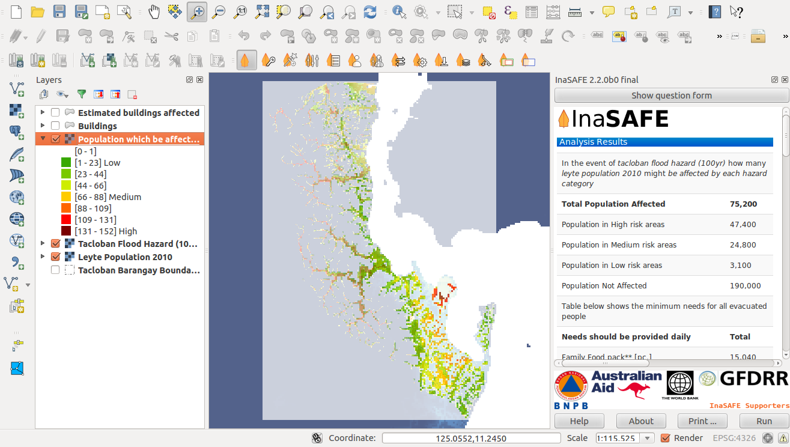

This is a collection of Philippine spatial data supporting testing and 
demonstration of InaSAFE (www.inasafe.org) which is a Free and Open 
Source tool designed to estimate impacts of natural hazard to people and infrastructure.

Contents
===============
### Hazard

 - Flood - Project NOAH
 - Landslide - Project NOAH
 - Storm Surge - Project NOAH
 - Earthquake - REDAS, PhiVolcs

### Exposure

 - Roads - OpenStreetMap
 - Buildings - OpenstreetMap
 - Population - WorldPop

License 
=================
See individual license file (*.lic) of each data.

Reference and Credits
========================

- Project NOAH - http://blog.noah.dost.gov.ph/citations/
- OpenStreetMap - http://www.openstreetmap.org/copyright
- WorldPop - http://www.worldpop.org.uk 

